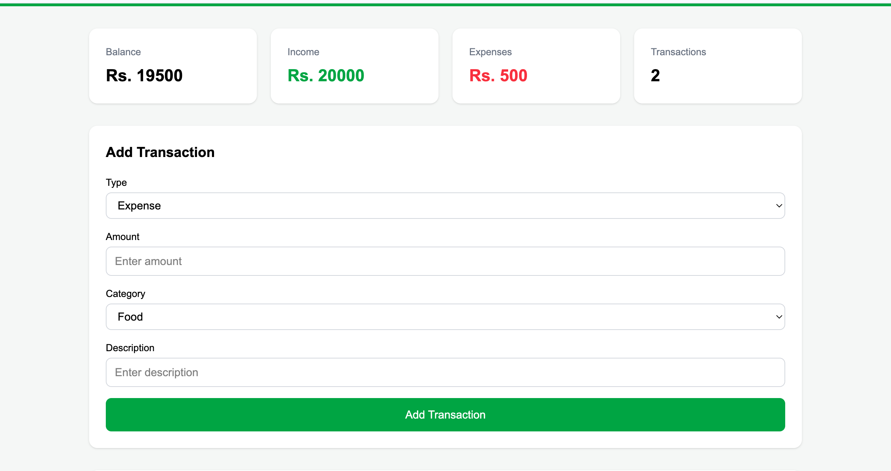
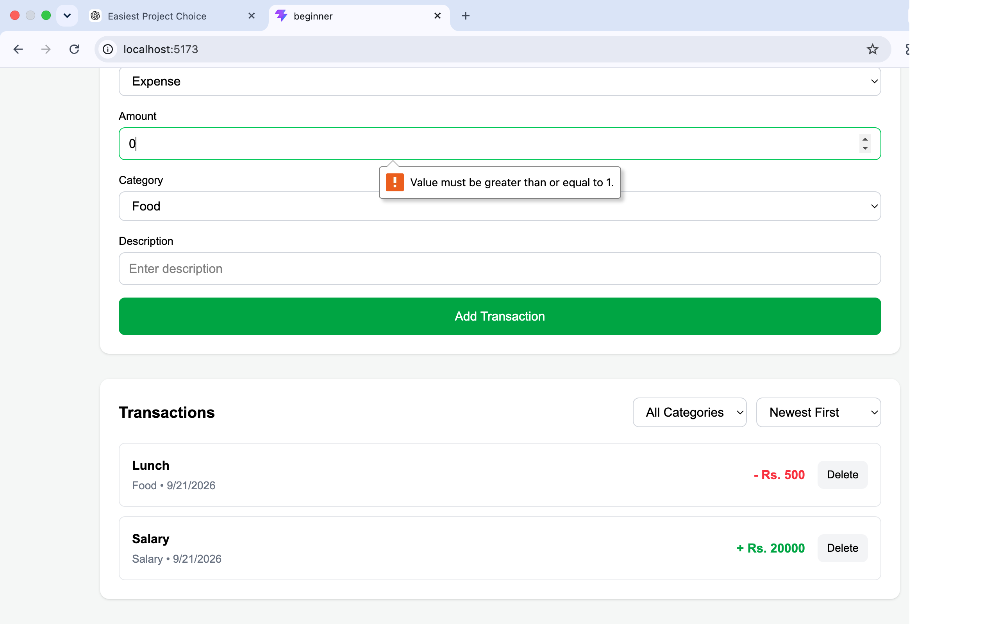
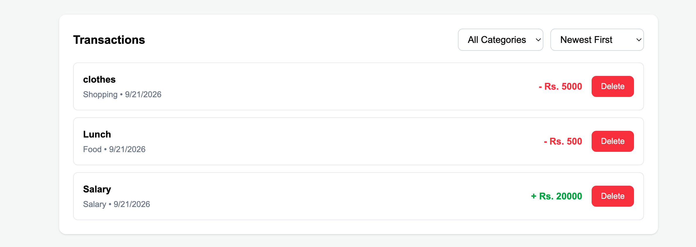

# Personal Expense Tracker

## Project Description

Personal Expense Tracker is a React-based web application that helps users manage their income and expenses.

Users can add transactions, view their balance, filter transactions by category, sort transactions by date, and delete transactions. Transaction data is saved in the browser using localStorage.

## Features

- Add income and expense transactions
- Enter transaction amount and description
- Select transaction category
- Calculate total income
- Calculate total expenses
- Calculate running balance
- Display total number of transactions
- Delete transactions
- Filter transactions by category
- - Sort transactions by newest, oldest, highest amount, or lowest amount
- Save transactions using localStorage
- Data remains available after refreshing the page
- Responsive design using Tailwind CSS

## Technologies Used

- React
- JavaScript
- Tailwind CSS
- Vite
- HTML
- localStorage

## React Concepts Used

This project uses the following React concepts:

- Functional Components
- Props
- useState
- useEffect
- Event Handling
- Conditional Rendering
- List Rendering with map()
- Controlled Form Components

## Project Components

```text
src/
├── components/
│   ├── Header.jsx
│   ├── Summary.jsx
│   ├── TransactionForm.jsx
│   ├── TransactionItem.jsx
│   └── TransactionList.jsx
│
├── App.jsx
├── App.css
├── index.css
└── main.jsx

## How to Run the Project

### 1. Install dependencies

```bash
npm install
```

### 2. Start the development server

```bash
npm run dev
```

### 3. Open the application

Open the localhost URL shown in the terminal.

## Data Storage

The application uses the browser's `localStorage` to save transaction data.

This allows transactions to remain available even after refreshing the browser.

## Screenshots

### Dashboard



### Form Validation



### Transactions



## Known Limitations

- The application stores data only in the browser's localStorage.
- Data will not be shared between different browsers or devices.

## Author

Suhan Waiba Tamang